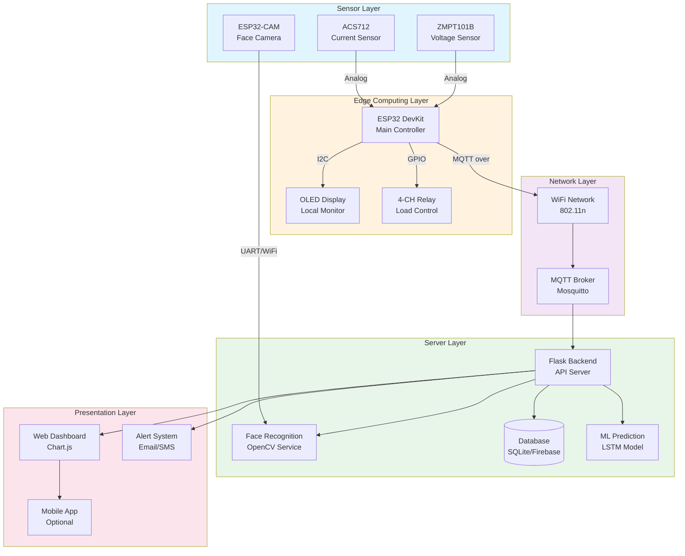
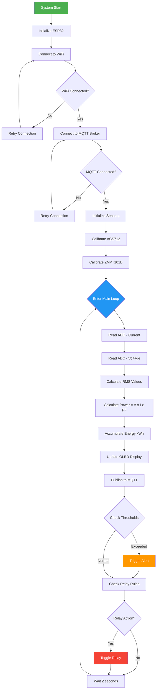
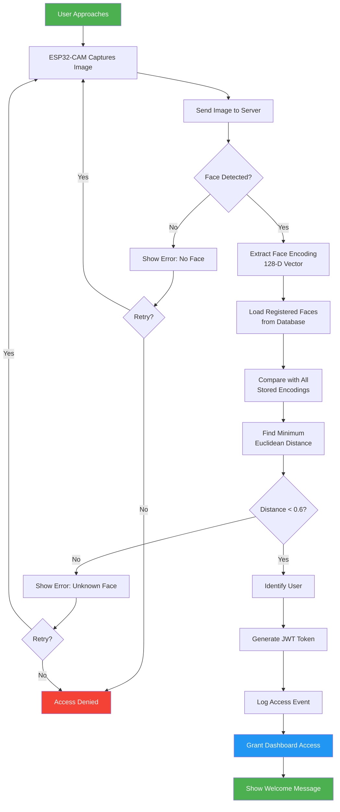
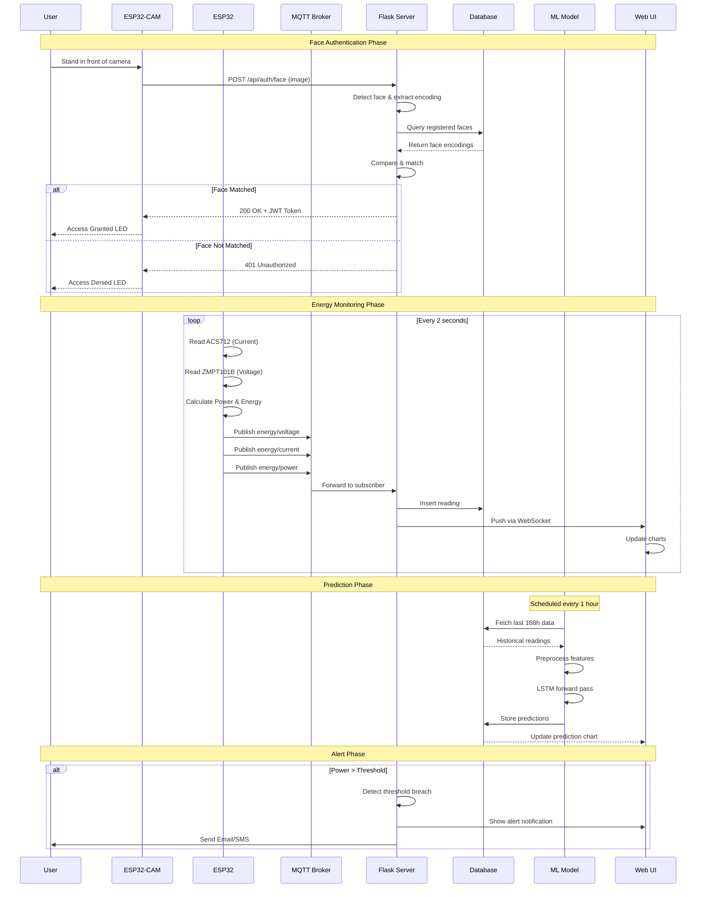
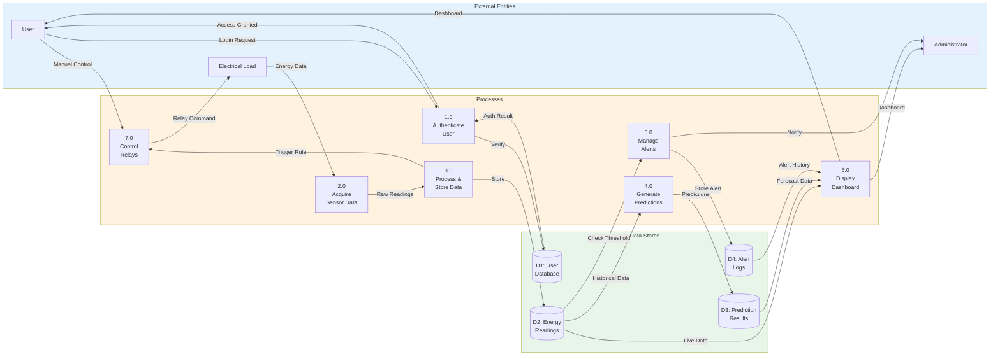
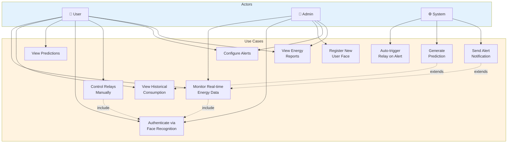
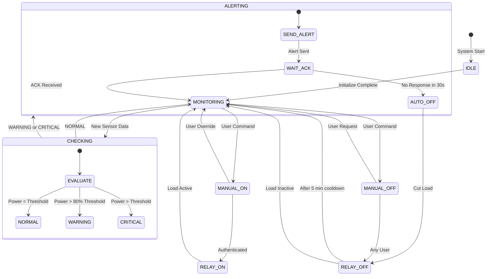
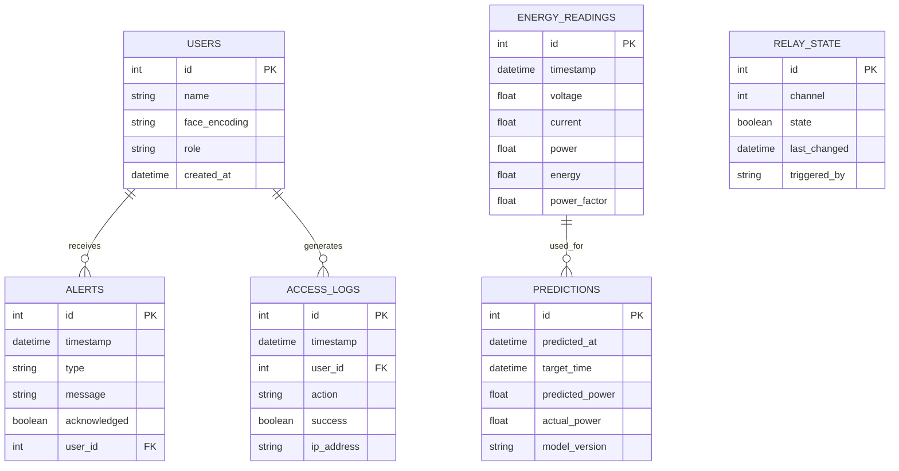
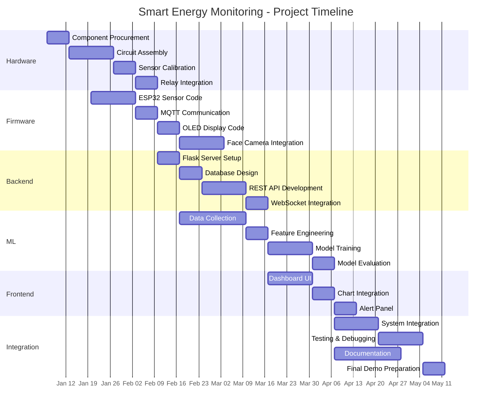

# DIAGRAMS - Smart Energy Monitoring System

All diagrams below use Mermaid syntax. Render them at https://mermaid.live/ or in any Markdown editor with Mermaid support.

---

## 1. Complete System Architecture

---

## 2. Energy Monitoring Flowchart

---

## 3. Face Recognition Flowchart

---

## 4. ML Prediction Pipeline

```mermaid
flowchart LR
    subgraph DATA ["Data Collection"]
        A1[Historical<br/>Energy Data]
        A2[Weather<br/>Data API]
        A3[Calendar<br/>Events]
    end

    subgraph PREP ["Data Preparation"]
        B1[Data Cleaning<br/>Remove Outliers]
        B2[Feature Engineering<br/>Lag, Rolling, Cyclic]
        B3[Normalization<br/>MinMax Scaling]
        B4[Train/Test Split<br/>80/20]
    end

    subgraph TRAIN ["Model Training"]
        C1[LSTM Architecture<br/>64-32-16-1]
        C2[Compile Model<br/>Adam Optimizer]
        C3[Train 100 Epochs<br/>Batch Size 32]
        C4[Early Stopping<br/>Patience 10]
        C5[Save Best Model<br/>.h5 file]
    end

    subgraph DEPLOY ["Deployment"]
        D1[Load Model<br/>on Server]
        D2[Schedule Job<br/>Every 1 Hour]
        D3[Fetch Latest<br/>Data Window]
        D4[Generate<br/>Predictions]
        D5[Store Results<br/>in Database]
        D6[Update<br/>Dashboard]
    end

    A1 --> B1
    A2 --> B1
    A3 --> B1
    B1 --> B2
    B2 --> B3
    B3 --> B4
    B4 --> C1
    C1 --> C2
    C2 --> C3
    C3 --> C4
    C4 --> C5
    C5 --> D1
    D1 --> D2
    D2 --> D3
    D3 --> D4
    D4 --> D5
    D5 --> D6

    style DATA fill:#e3f2fd
    style PREP fill:#fff3e0
    style TRAIN fill:#e8f5e9
    style DEPLOY fill:#fce4ec
```

---

## 5. Sequence Diagram - Complete Operation

---

## 6. Data Flow Diagram - Level 1

---

## 7. Use Case Diagram

---

## 8. State Diagram - Relay Control

---

## 9. ER Diagram - Database Schema

---

## 10. Gantt Chart - Project Timeline

